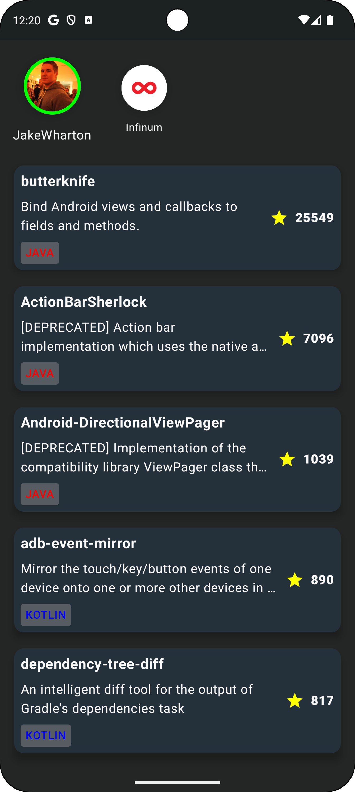

# Repormation 🔎
This app will fetch the GitHub repositories of the great dev Jake Wharton and Infinum, by the moment. I will add a TextField later in order to access any repo of your like!

### Project Architecture
- Fully multi-modular 🧩
- Feature layered 📕
- Each module follows Clean Architecture by implementing 100% Kotlin `:domain` modules 🧼
- Uses Koin for DI 💉
- MVVM as Presentation Pattern ⻮
- Compose

### Images
- User's repo list

- Repo details

### How to compile the project
As GitHub api limits the requests per hour and we don't wanna run out of fun too quick, you need to create your GitHub `PAT`, no permissions required for the `PAT`.
- Make sure to have your `local.properties` file in the root folder ✅
- Insert `API_KEY=YOUR_PAT` as value in the `local.properties` file ✅
- Ready to rock & roll. 🤘

